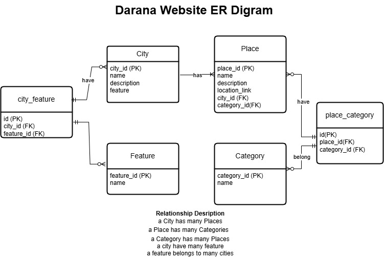

# Darana Website (دارنا) 
Darana (meaning "Our Home" in Arabic) is a website dedicated to showcasing the beauty, culture, and hidden gems of Saudi Arabia.
Through Darana, visitors can explore cities, discover historic sites, entertainment spots, cafes, and restaurants across the Kingdom.
The name reflects a deep connection to the homeland — Saudi Arabia as a shared "home" full of treasures to experience.

## Repository Description

This repository contains the backend source code of the application, built using Django and Django REST Framework. The project is organized to separate core functionality, API logic, and configuration.

### Folder Structure

- **`main_app/`**  
  Core Django app containing all backend logic:
  - `models.py` – Defines the data models (database schema).
  - `serializers.py` – Converts model instances to JSON and handles validation.
  - `urls.py` – Maps API endpoints to views.
  - `admin.py` – Registers models for access in the Django admin panel.
  - `views.py` – Contains class-based views for handling GET, POST, PATCH, and DELETE requests.

- **`darana_project/`**  
  Django project configuration:
    - `settings.py` – Defines project settings including installed apps, middleware, database configuration, authentication, and more.

## Tech Stack

### Languages & Frameworks
- **Python** – Main programming language.
- **Django** – Web framework for building the backend.
- **Django REST Framework** – Toolkit for building Web APIs.

### Libraries & Packages
- **djangorestframework-simplejwt** – Handles JWT authentication.
- **psycopg2-binary** – PostgreSQL database adapter for Python.
- **django-cors-headers** – Manages Cross-Origin Resource Sharing (CORS).

### Tools & ServicesC
- **PostgreSQL** – Relational database used for storing application data.
- **Postman** - Used to test urls.
## ERD Diagram

## Frontend Repository
You can find the frontend code here: [Frontend Repository Link](
    https://git.generalassemb.ly/razanalshaikh/react-darana-frontend.git
)
## RESTful Routing Table for both Client and Server

### Backend Routing Table (Server-Side – Django URLs)
|RouteName|Method  |URL       |Description        |status    |
|:--------|:------:|--------:|------------------:|----------:|
| index   | GET    |'api/cities/'|  Display all cities|✅|
| Create  | POST   |'api/cities/'| add new city to database and redirect to cities Page|✅|
| Show    | GET    |'api/city/<int:pk>/'|  Display a city|✅|
| Edit    | GET    |'api/city/<int:pk>/'| Show info about one city|✅|
| Update  | PATCH  |'api/city/<int:pk>/'| update a city then redirect |✅|
| Destroy | DELETE |'api/city/<int:pk>/'| delete a city then redirect|✅|
| index   | GET    |'api/cities/<int:city_id>/places'|  Display all places for one city|✅|
| index   | GET    |'api/places/'|  Display all places|✅|
| New     | GET    |'api/places/| show form to add a new place|✅|
| Create  | POST   |'api/places/' | add new place, then redircet|✅|
| Show    | GET    |'api/places/<int:pk>/'| show place details| ✅|
| Edit    | GET    |'api/places/<int:pk>/'|  show edit form of place details|✅|
| Update  | PATCH  |'api/places/<int:pk>/'|Update a place then redirect|✅|
| Destroy | DELETE |'api/places/<int:pk>/'|Delete place then redirect|✅|

### Frontend Routing Table (Client-Side – React Router)
| Path                      | Component        | Description                        |
|---------------------------|------------------|------------------------------------|
| `/`                       | `Home`           | Landing page                       |
| `/cities`                 | `Cities`         | Displays list of all cities        |
| `/cities/new`             | `AddCity`        | Form to create a new city          |
| `/city/:id`               | `CityDetails`    | Details for a specific city        |
| `/city/:id/edit`          | `EditCity`       | Edit an existing city              |
| `/places`                 | `Places`         | Displays list of all places        |
| `/places/new`             | `AddPlace`       | Form to add a new place            |
| `/places/:id`             | `PlaceDetails`   | Details for a specific place       |
| `/places/:id/edit`        | `EditPlace`      | Edit a specific place              |
| `/city/:id/places`        | `PlacesList`     | List of places for a given city    |
| `/signup`                 | `SignUp`         | User registration page             |
| `/login`                  | `Login`          | User login page                    |
| `*`                       | `NotFound`       | Fallback page for undefined routes |

## Installation Instructions
### Run Locally
1. Clone the repository:  
  ` git clone https://git.generalassemb.ly/razanalshaikh/django-darana-backend.git `
2. Navigate to the project directory
    `cd django-darana-backend`
3. Activate the virtual environment using pipenv
    `pipenv shell`
4. Install Dependencies
    `pipenv install`
5. Apply Database Migrations
    `python manage.py makemigrations`
    `python manage.py migrate`
6. Create a Superuser
    `python manage.py createsuperuser`
7. Run the Development Server
    `python manage.py runserver`
8. Make sure PostgreSQL is installed and configured, and that your DATABASES settings in settings.py are correctly set up for your local environment.

## IceBox Features
- Cerate a catergory model to make places displayed by categories.
- Add maps and location for places.
- Add reviews and rating for places.
- Save places for users side as want to go list.
- Add more images and description for each place and each city.
- Add search buttons, where user searched for places and cities.
- Add different rule for users.
